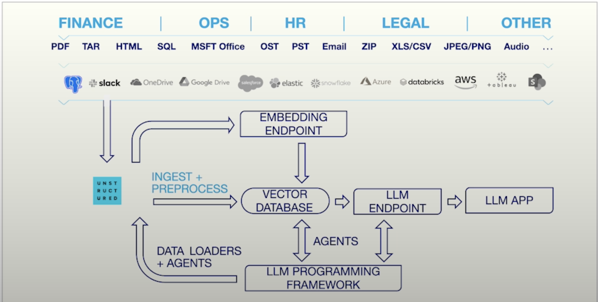
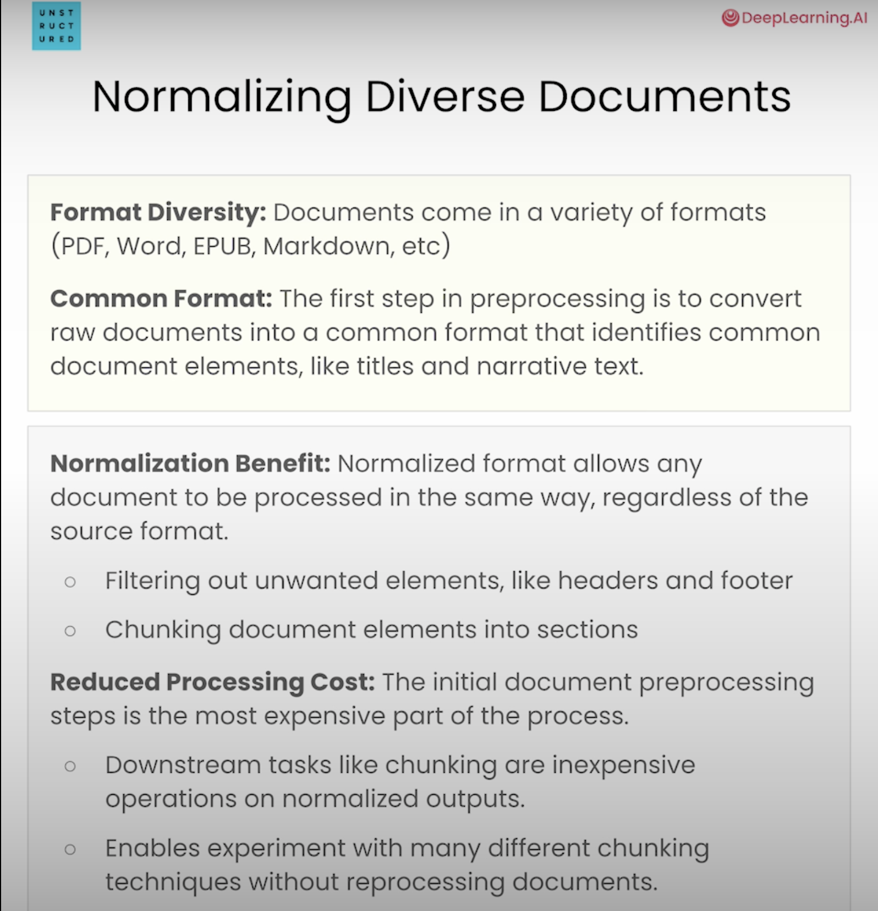

# Exploring Unstructured package
# Preprocessing Unstructured Data for LLM Applications

[DeepLearningAI](https://learn.deeplearning.ai/courses/preprocessing-unstructured-data-for-llm-applications/lesson/1/introduction)

By matt Robinson (Unstructured) and Andrew Ng

To be noted that using Unstructured requires to send data to an API. https://app.unstructured.io/keys So in terms of security GPRD, don't seems good enough. 

RAG : 
- data loading, 
- chunking
- embedding 
- storing the vector database
- then retrieval

Unstructured data formats : text, images, tables, bulleted lists...
From many different types of sources : PDF, PowerPoint, Word, markdown, excel, slides, keynotes, outlook, slack or teams, webpages html...

Data loader must be able to 
1) parse many different file formats. 
2) normalize the data from these different sources so that it can all be represented in a similar way
3) maintain so sort of structure of the original document by preserving that structured information in metadata (paragraph, titles... tree hierarchical structure). Enrich the content with metadata enhancing RAG results and supporting nuanced search capabilities

*Data preprocessing* / data engineering : to extract and normalize content from a wide variety of document types

*Data engineering* is a key aspect of getting the context you need to your LLM to let them do well on your application. 

# Overview of LLM Data pre-processing 

*RAG* a technique for grounding LLM responses on validated external information

*contextual integration* RAG apps load context into a database, then retrieve content to insert into a prompt that is passed to the LLM. The LLM can use these external elements to construct its response. 

*Preprocessing outputs*
- *Document content* : text content from the documents. Used for keyword or similarity search in Rag apps. 
- *Document elements* The basic building blocks of a document. Useful for various RAG tasks, such as filtering and chunking semantically : title, narrative text, list item, table, image...
- *Element metadata* Additional information about an element. Useful for filtering in hybrid search and for identifying the source of a response : filename, filetype, page number, section...

*Why is data processing hard? *
- *content cues* : different document types = different cues to identify the same element (for example a header h1 or # or...) 
- *standardization need* : variety of formats, so standardization needed so that you app can process them in the same way
- *Extraction variability* : different document formats may require different extraction approaches (forms vs. journal articles...)
- *metadata insights* : extracting metadata requires an understanding of document structure.

# Normalizing the content
Documents come in a variety of formats (pdf, Word, EPUB, Markdown...) -> normalize so that you can process all documents the same way, with the same snippet of code. No need to add separate logic for each type of documents

The first step in preprocessing is to convert raw documents into a common format that identifies common document elements, like titles and narrative text. 

## Normalization benefits : 

- filtering out unwanted elements like header and footer
- chunking document elements into sections (experiment different chunking strategies)
- reduce preprocessing costs (most expensive part = extracting the initial content)

## Data Serialization
Serialization benefits : serialization allows the results of document preprocessing to be used again later. Here, we will serialize the data as JSON. JSON has the advantages :
- structure is common and well understood
- is a standard HTTP response
- able to be used in multiple programming languages
- can be converted to JSON by streaming use cases

## HTML Page
- LLM relevance : integrating fresh internet data into LLMs to maintain their currentness and relevance
- HTML understanding: essential for structuring web content, using elements like h1 for titles.
- Data extraction and categorization: analyzing HTML elements to extract and organize web content into structured formats for relevant information distillation